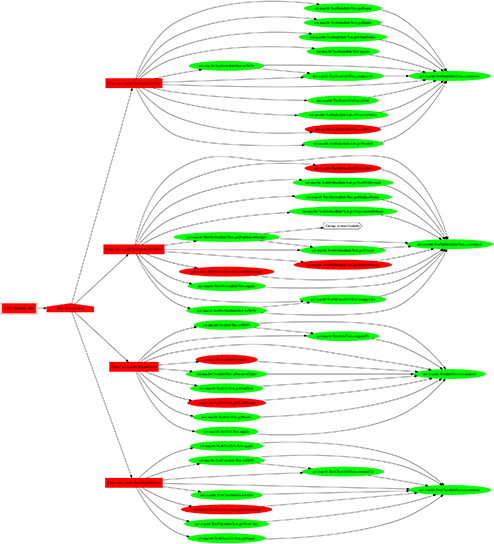

Dependency Reporter for TestNG
==============================
An `IReporter` and `IResultLisener` for TestNG that can analyze the test `ISuite`,
determine the dependency graph, and produce .dot (graphviz), .png,
or .json representations of the graph at each node.

[](examples/report.png)

Current version
-------------------
1.0.0-SNAPSHOT

Availability
-------------------
Not yet published. Source code only.

License
-------
[Apache Software License v2.0](http://www.apache.org/licenses/LICENSE-2.0)

Compilation
-----
```shell
$ mvn clean install
```

Installation
-----
Use the `TestNGAnalyzer-{version}.jar` as a test dependency for your project by
adding it to the _CLASSPATH_.

With Maven, this looks like:
```xml
<dependency>
  <groupId>net.mach6</groupId>
  <artifactId>testng-dependency-reporter</artifactId>
  <version>1.0.0-SNAPSHOT</version>
  <scope>test</scope>
</dependency>
```

Usage
-----
With Maven Surefire
```shell
$ mvn test [-DdependecyReport=[report options]] [surefire options]
```
With vanilla `java`, assuming all jars are in your CLASSPATH
```shell
$ java [-DdependencyReport=[report options]] org.testng.TestNG [testng options]
```

__Report Options__

All "command line" options for this reporter are passed via the JVM system
property `dependencyReport`. The format is `option:value[,option:value...]`

| Option | Values (bold is the default) |
| :----: | :--------------------------- |
| `enabled` | __true__, _false_ |
| `prescan` | _true_, __false__ |
| `mode`| __all__, _suites_, _tests_, _classes_, _methods_ |
| `output` | __all__, _dot_, _png_, _json_ |

For example:
```shell
$ mvn test -DdependencyReport=prescan:true,output:png
```

Credits
-------
Inspired by [this work](https://github.com/tomekkaczanowski/testng-test-dependencies-reporter) of Tomek Kaczanowski
